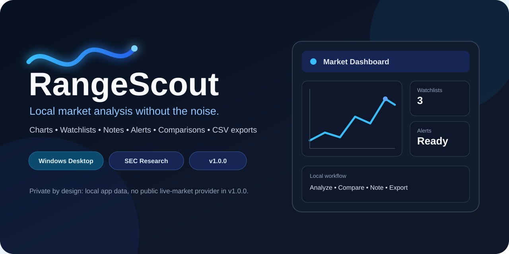
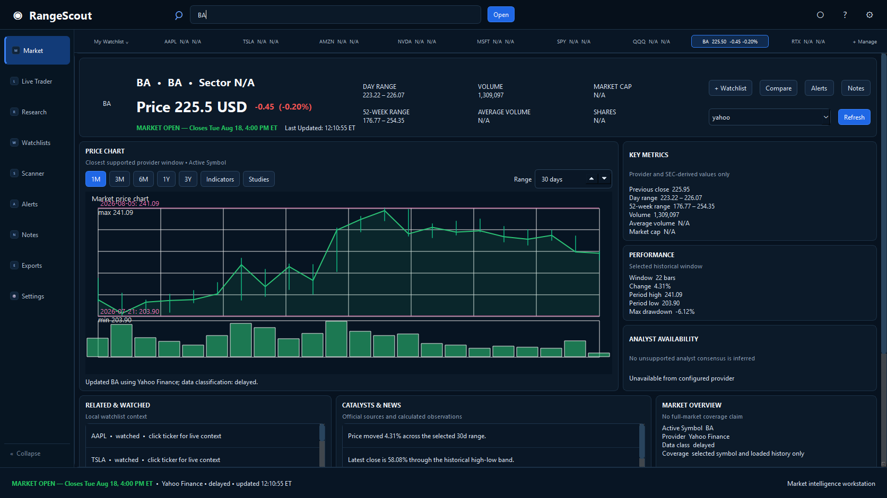
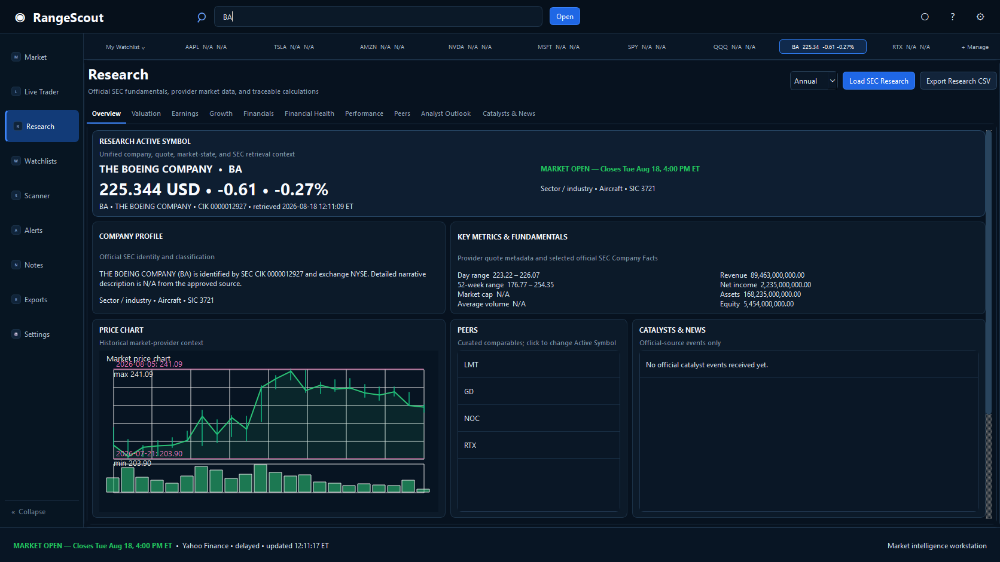
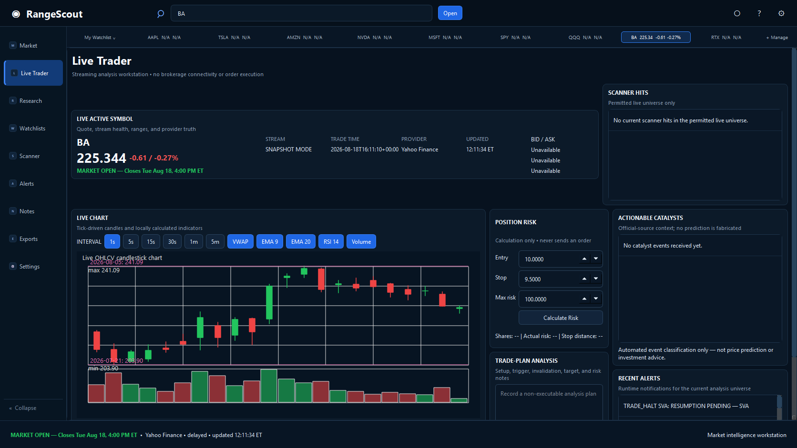

  

  
  
  
  
  

<h1 align="center">RangeScout 1.6.2</h1>

  <strong>A Windows market intelligence workstation from Dietrich AI Labs.</strong> 
  Live market context, candlesticks, research, watchlists, scanner results, alerts, catalysts, notes, and exports — all centered on one Active Symbol.

<strong>Publisher/company: Dietrich AI Labs</strong>

  <a href="https://github.com/dietrichailabs-oss/RangeScout/releases/latest/download/RangeScout_1.6.2_Windows.zip"><strong>⬇ Download for Windows</strong></a>
  &nbsp;&nbsp;•&nbsp;&nbsp;
  <a href="https://github.com/dietrichailabs-oss/RangeScout/releases/latest"><strong>Release Notes</strong></a>
  &nbsp;&nbsp;•&nbsp;&nbsp;
  <a href="https://github.com/dietrichailabs-oss/RangeScout/issues"><strong>Report an Issue</strong></a>

---

## See RangeScout in action

  <strong>Market workspace</strong>  
  

<table>
  <tr>
    <td width="50%" align="center">
      <strong>Research & Fundamentals</strong>  
      
    </td>
    <td width="50%" align="center">
      <strong>Live Trader</strong>  
      
    </td>
  </tr>
</table>

Screenshots show the RangeScout 1.2 interface. Market values, availability, and freshness depend on the configured provider and current market conditions.

---

## What's new in RangeScout 1.6.2

RangeScout 1.6.2 is a much larger release than the point-version number suggests. From the exact 1.6.1 baseline to the final R18 source candidate, the release accumulated 36 source-control commits covering the Market experience, canonical instrument identity and discovery, provider routing, Research semantics, SEC filing selection, persistence, migrations, and release hardening. The goal throughout the release was deterministic identity and data selection: the symbol, security type, reporting period, provider route, and displayed value should stay coherent even when upstream data is incomplete or ambiguous.

### Market, Active Symbol, and data presentation

- **Fused quote/history presentation** — current quote state and historical context are combined more carefully so a stale or slower history response cannot overwrite the more current visible quote state.
- **Immediate identity-bound transitions** — committing a new Active Symbol clears stale symbol-specific state first, then loads the new canonical identity before asynchronous Market, Research, analyst, catalyst, and logo work can repopulate the UI.
- **Stale-result rejection** — background results are checked against the active request/symbol before presentation so a late result for the previous symbol cannot bleed into the newly selected instrument.
- **Clearer status and formatting** — provider provenance, availability, cached/delayed/offline states, quote movement, and unsupported data remain explicit rather than being silently substituted.
- **Reserved visible-quote priority preserved** — the 1.6.1 quote-priority lane remains intact so slower history, Research, scanner, news, logo, and other background work cannot starve the quote path the user is actively looking at.
- **Alert and catalyst presentation cleanup** — user-facing alert/catalyst formatting and correlation were tightened so symbol-specific context stays attached to the correct Active Symbol while broad-market events remain distinguishable.

### Canonical instrument identity, search, and discovery

- **Canonical instrument intelligence layer** — RangeScout now resolves a stable internal identity before routing an instrument into Market, Research, providers, and the rest of the workstation.
- **Exact ticker precedence** — exact canonical ticker matches outrank legacy aliases and looser name matches, preventing aliases from stealing an exact symbol selection.
- **Ranked disambiguating search** — symbol and company-name search uses deterministic ranking rather than relying on raw row order.
- **Better punctuation/name normalization** — search indexes punctuation-preserved, punctuation-separated, and punctuation-deleted name forms so names containing punctuation remain discoverable without creating loose accidental matches.
- **Conjunction-aware matching** — multi-token company searches require meaningful token agreement instead of allowing a single common word to dominate the result.
- **Historical issuer aliases preserved safely** — unique historical names and aliases remain searchable while current canonical identity stays authoritative.
- **Broader security-type semantics** — discovery/classification was hardened across supported equities and non-common-equity instruments, including preferreds, ADRs, ETFs, closed-end funds, warrants, rights, units, ETNs, indices, partnerships, and related issuer structures.
- **Issuer-aware classification** — security type is no longer inferred from a single superficial suffix or label when issuer structure or official listing evidence says otherwise.
- **Stable discovery reconciliation** — official discovery refreshes merge into the existing catalog without casually destroying identity, aliases, listing history, or newer local state.
- **Fail-closed official-source refreshes** — incomplete or obviously truncated official discovery inputs are rejected rather than being treated as a legitimate delisting/removal event.
- **Idempotent schema recovery** — database migration/recovery work was hardened so repeating recovery does not keep mutating an already-correct catalog.

### Provider symbol routing and capability behavior

- **Canonical-to-provider symbol mapping** — provider adapters receive the provider-specific representation of the selected canonical instrument instead of assuming every provider accepts the same raw symbol text.
- **Full-catalog routing corrections** — symbol routing was exercised across the broader instrument catalog, not only ordinary common-stock tickers.
- **Streaming pair safety** — canonical pair identities are kept separate from raw provider subscription strings so internal identity does not leak into an incompatible streaming request format.
- **Versioned classification/capability data** — instrument classification and provider capability decisions are backed by versioned local reference data rather than ad-hoc UI guesses.
- **Explicit unsupported states** — if the selected instrument/provider combination cannot legitimately provide a requested capability, RangeScout reports that state instead of fabricating a route or a value.

### Research routing and instrument-aware behavior

- **Research now routes by instrument semantics** — corporate issuers, funds, and other market instruments take different Research paths rather than every ticker being treated as an operating company.
- **Fund-aware Research path** — fund/closed-end-fund style instruments can surface appropriate supported context without being forced through corporate SEC metrics that do not apply.
- **Preferred, partnership, LLC-unit, and related issuer semantics** — Research classification was corrected so legal/security structure does not accidentally masquerade as common equity.
- **IFRS-aware fundamentals** — reporting-regime selection and compatible taxonomy/unit handling were hardened for issuers that report under IFRS as well as US GAAP.
- **Current reporting regime selection** — older filings in a different taxonomy, currency, or reporting regime no longer automatically override the issuer's coherent current regime.
- **Unsupported Research remains explicit** — cards use clear unavailable/N/A states when a legitimate comparable fact does not exist; RangeScout does not manufacture a value to fill the screen.

### SEC fiscal periods, amendments, and growth calculations

- **Deterministic duration semantics** — quarterly, year-to-date, annual, annual-transition, and instant facts are kept distinct instead of being treated as interchangeable SEC rows.
- **Quarter/YTD and annual/Q4 separation** — duration and fiscal-period rules prevent year-to-date data from masquerading as a quarter and prevent a fourth-quarter identity from silently replacing an annual period.
- **Per-metric amendment/restatement merging** — amended filings are reconciled at the metric level so a partial amendment does not erase valid untouched metrics from the original filing.
- **Stable quarterly growth comparisons** — current/prior-period selection is row-order independent and uses coherent period identity before calculating growth.
- **Fiscal and calendar identity separated** — SEC `frame` metadata is no longer treated as if it were the issuer's fiscal quarter/year identity.
- **Atomic fiscal identity** — `fy` and `fp` are used as one coherent fiscal pair; a missing fiscal component is not silently filled with a calendar-frame component to create an identity that never existed.
- **Safe frame-only fallback** — when both fiscal identity fields are absent, a valid compatible SEC frame can provide a clearly labeled calendar fallback rather than being hybridized with partial fiscal metadata.
- **SEC best-alignment frame handling** — frame validation uses deterministic start/end alignment against adjacent calendar periods rather than an arbitrary fixed calendar-boundary cutoff.
- **Off-calendar issuers supported correctly** — valid fiscal quarters ending around dates such as April 30, July 31, October 31, and January 31 can remain comparable when their SEC calendar frame is the best aligned period.
- **52/53-week reporters supported** — valid periods ending several days around nominal quarter/year boundaries, including July 4 and January 3 style cases, are no longer rejected merely because the raw end date is not the literal calendar boundary.
- **Wrong adjacent frames still fail closed** — the broader alignment logic does not simply disable validation; malformed frames, annual/quarter mismatches, ambiguous ties, and clearly wrong adjacent-period frames remain rejectable.

### Persistence, lifecycle, and release reliability

- **Historical-store migrations expanded through the 1.6.2 schema line** — new identity/classification/search state has explicit migrations rather than depending on a clean database.
- **Notes and local state preservation hardened** — existing user-owned data remains attached to the correct symbol identity as the catalog evolves.
- **Clean reference seeding/startup work** — initial instrument/reference seeding was made deterministic and kept within the startup performance gate.
- **Installer upgrade path verified** — the supported 1.6.1 → 1.6.2 in-place upgrade preserves the install location, settings, and user AppData while replacing the runtime with the exact 1.6.2 build.
- **Uninstall scope verified** — normal uninstall removes RangeScout-owned install files, shortcuts, and product registry state while preserving user AppData/exports and leaving out-of-scope files untouched.
- **Regression coverage greatly expanded** — deterministic tests were added for discovery safety, reconciliation, provider symbol routing, security classification, search normalization, IFRS/unit semantics, SEC durations, amendments, fiscal/calendar identity, off-calendar frames, row-order independence, packaging, and installer behavior.

Across all of these changes, RangeScout keeps the same core rule: missing, unsupported, stale, or ambiguous upstream data must remain visible as such. It does not fabricate market, Research, analyst, or catalyst values to make the interface look complete.

## Preserved 1.6.0 provider platform

RangeScout 1.6.0 preserves the QA-approved broad local company master and adds a dedicated provider-management experience:

- **Data Providers & API Keys** — one owned RangeScout screen contains routing mode, provider capabilities, health, secure BYO credentials, and fixed official signup links.
- **Smart Search (Recommended)** — races only configured, capability-compatible healthy providers and accepts the first fresh validated result while honoring rate limits and circuit breakers.
- **Forced provider mode** — queries only the chosen compatible provider and reports a clear failure without silent fallback.
- **Clean Settings** — normal Settings has one provider-management button; credential values remain solely in Windows Credential Manager.

The accepted 1.5 local-first, performance, database, and accessibility behavior remains intact:

- **Network-failure-proof local-first Market** — startup and committed symbols render one bounded SQLite snapshot immediately; quote and history refresh independently in background workers, with last-known prices explicitly labeled Cached and no provider I/O on the Qt UI thread.
- **Redistributable company master** — a small versioned SQLite seed supplies common issuer identity, exchange/MIC, CIK, aliases, sector, and industry offline, then merges additively without replacing newer user data.
- **Local company database maintenance** — expanded SQLite company identity, aliases/listing state, logo provenance, health checks, manual maintenance, and Off/Weekly/Monthly scheduling.
- **True Windows System theme** — System follows the effective Windows/Qt app color scheme while running; explicit Light and Dark remain overrides.
- **Instant symbol transitions** — committed Active Symbol changes synchronously clear old quote, chart, Research, analyst, catalyst, and logo state before cached/local-first rendering and background refresh.
- **Accessible price movement** — regular-session moves use green `▲`, red `▼`, or neutral `—`; company identity remains neutral and extended-hours values remain separately labeled.
- **Freshness and recovery UX** — compact live/cached/delayed/offline states, loading placeholders, one cached-data offline banner, retry actions, and optional provider diagnostics.
- **Remembered workstation state** — last page, Research period, watchlist, window geometry, recent symbols, and keyboard shortcuts, plus credential-free preference export/import.

## Preserved 1.4.1 Research and analyst foundation

RangeScout preserves the complete tray-enabled 1.4.1 workstation, including automatic Research loading and optional BYO analyst data:

- **Automatic Research loading** — opening Research, changing the Active Symbol while Research is visible, or changing Annual/Quarterly mode automatically refreshes the current context with debounce, request deduplication, and stale-result protection.
- **Optional Analyst Outlook sources** — Finnhub recommendation trends are shown when the configured account is entitled, and Alpha Vantage `EARNINGS_ESTIMATES` supplies available forward EPS/revenue estimates. RangeScout does not scrape Yahoo or consumer analysis pages.
- **Quota-protecting SQLite analyst cache** — Finnhub recommendations use a six-hour TTL and Alpha Vantage estimates use a 24-hour TTL, with explicit fresh, cached, stale, not-configured, entitlement, and rate-limit states.
- **Official signup buttons** — every visible credential field has a fixed official `Get API Key` or `Get Publishable Key` destination; credentials remain in Windows Credential Manager.

The preserved 1.4.0 foundation includes:

- **Optional company logos** — Market and Research can display a Logo.dev ticker logo when the user securely configures their own publishable key; unavailable logos immediately retain the ticker monogram.
- **Privacy-preserving cache** — image bytes remain only in a bounded 24-hour session-memory cache; SQLite stores retry/status/provenance metadata and never image BLOBs or keys.
- **Nonblocking and symbol-safe** — user-driven background requests cannot interrupt market/research workflows, and stale logo results cannot overwrite a newer Active Symbol.
- **Close to system tray** — pressing the title-bar **X** or Alt+F4 keeps RangeScout running in the Windows notification area; use the matching RangeScout tray icon to reopen the workstation or choose **Exit RangeScout** to stop it completely.
- **One consistent app icon** — the executable, taskbar, window, shortcuts, installer, and tray use the same RangeScout-owned icon asset.

The preserved 1.3 foundation includes:

- **Provider fabric** — the user-visible quote/history/candle path now uses capability- and terms-aware fastest-valid routing with winner provenance, contextual health/ranking, circuit breakers, centrally enforced pacing/quota controls, bounded caching, and discrepancy disclosure.
- **Broader legitimate coverage** — official public Coinbase Exchange, Kraken, and CoinPaprika market data plus optional user-key Twelve Data, Alpha Vantage, and FRED adapters.
- **Instrument discovery** — nonblocking weekly and manual official Nasdaq Trader discovery with status/hash/diffs, stable venue-change identity, aliases, rollback, and non-destructive inactivation.
- **Expanded domain architecture** — normalized crypto products, futures contracts and disclosed continuous-series rules, with options kept architecture-only until an eligible source exists.

- **Global Active Symbol** — Market, Live Trader, Research, watchlists, scanner context, alerts, notes, and exports stay synchronized to the stock you are viewing.
- **True OHLCV candlesticks** — Live Trader renders open, high, low, close, and volume candles with local indicator overlays.
- **Research & Fundamentals** — filing-backed SEC research with Overview, Valuation, Earnings, Growth, Financials, Financial Health, Performance, Peers, Analyst Outlook availability, and Catalysts & News.
- **Watchlist ticker ribbon** — compact, clickable symbol context across the top of the workstation.
- **Active-Symbol catalysts** — company-specific events stay attached to the correct symbol while broad policy events remain clearly identified as broad-market context.
- **Expanded workflow tools** — improved Watchlists, Scanner, Alerts, Notes, Exports, and Settings.
- **Windows desktop identity** — stable Dietrich AI Labs application identity and grouped taskbar behavior.
- **Production cleanup** — retired provider paths are not exposed in the production app.

---

## At a glance

| Workspace | What it does |
| --- | --- |
| **Market** | Quotes, historical context, charts, ranges, market state, watchlist context, and provider-aware metrics. |
| **Live Trader** | Candlesticks, local indicators, stream/snapshot status, risk calculations, scanner context, alerts, and catalysts. |
| **Research** | SEC-backed company facts, valuation, earnings, growth, financial statements, financial health, performance, peers, and catalysts. |
| **Watchlists** | Organize symbols, monitor changes, and move the Active Symbol across the rest of the app. |
| **Scanner** | Provider-limited scanning across the active/subscribed/watchlist universe — never falsely presented as full-market coverage. |
| **Alerts** | Price, live-data, catalyst, halt, and workflow alerts with cooldown protection. |
| **Notes** | Local symbol-linked research notes and trade-planning context. |
| **Exports** | Export supported research, watchlist, scanner, catalyst, and user workflow data. |
| **Settings** | Themes, providers, streaming, research sources, alerts, local-data controls, and app information. |

---

## Download & install

The recommended public download is:

**[RangeScout_1.6.2_Windows.zip](https://github.com/dietrichailabs-oss/RangeScout/releases/latest/download/RangeScout_1.6.2_Windows.zip)**

**Embedded installer SHA-256:** `5B0A5822ED09004405BA0BEEA6C5473BF77E283DDA7BBBF622D07C15B888D52D`

1. Download `RangeScout_1.6.2_Windows.zip` from the latest release.
2. Extract the ZIP.
3. Run `RangeScout_1.6.2_Setup.exe` and follow the Windows prompts.
4. Windows may display a reputation or security warning because the installer is not publicly trusted-signed.
5. If desired, verify the public ZIP SHA-256 published in the release notes and the embedded installer SHA-256 above.
6. Launch RangeScout from the Start menu or desktop shortcut, then add optional provider credentials under **Settings → Data Providers**.

> [!NOTE]
> The installer is not currently Authenticode-signed, so Windows may display a reputation warning. A publicly trusted Authenticode certificate is required to remove that unsigned-publisher limitation. Verify the published SHA-256 before installation.

Installing over an earlier version preserves application data under `%AppData%\RangeScout`. Normal uninstall also preserves user data and exported files so they remain available after reinstall.

### Running in the system tray

RangeScout is designed to keep monitoring and alert services active when the main window is closed:

1. Click the title-bar **X** or press **Alt+F4** to hide RangeScout to the Windows system tray.
2. Click or double-click the RangeScout tray icon to reopen the workstation.
3. Right-click the tray icon and choose **Exit RangeScout** when you want to stop the application completely.

If the desktop does not provide a usable system tray, RangeScout closes normally so it cannot become an inaccessible background process.

---

## Free accounts & API keys

RangeScout works with public/free data sources, but a few enhanced features use your own free API key.

| Service | Used for | Key required? | Official setup |
| --- | --- | --- | --- |
| **Yahoo** | Quotes and historical bars | No user-entered key | Built in |
| **Finnhub** | Supported live trade streaming and entitled recommendation trends | **Yes** | [Create account](https://finnhub.io/register) · [Pricing](https://finnhub.io/pricing) |
| **Alpha Vantage** | Optional `EARNINGS_ESTIMATES` analyst outlook | **Yes** | [Request API key](https://www.alphavantage.co/support/#api-key) |
| **Twelve Data** | Optional provider-fabric market data | **Yes** | [Official site](https://twelvedata.com/) |
| **FRED** | Optional macro-series context | **Yes** | [Request API key](https://fred.stlouisfed.org/docs/api/api_key.html) |
| **SEC EDGAR** | Filings and XBRL fundamentals | No | [SEC API docs](https://www.sec.gov/search-filings/edgar-application-programming-interfaces) · [data.sec.gov](https://data.sec.gov/) |
| **Congress.gov** | Optional legislative catalyst source | **Yes, if enabled** | [Request API key](https://api.congress.gov/sign-up) |
| **Logo.dev** | Optional Active Symbol company logos | **Yes** | [Create account](https://www.logo.dev/signup) · [Ticker API docs](https://www.logo.dev/docs/logo-images/ticker) |
| **Nasdaq Trader** | Trading halt/resume context | No | [Trading Halts](https://nasdaqtrader.com/trader.aspx?id=TradeHalts) |
| **White House** | Government/policy catalysts | No | [Presidential Actions](https://www.whitehouse.gov/presidential-actions/) |

### Finnhub live streaming

1. Create a Finnhub account using the official registration link above.
2. Copy your API key from Finnhub.
3. Open **RangeScout → Settings → Data Providers → Finnhub**.
4. Save the key.
5. Open **Live Trader** and confirm the displayed connection/status state.

RangeScout does **not** ship a shared Dietrich AI Labs market-data or logo-provider credential.

---

## Candlesticks & local analysis

Live Trader uses genuine OHLCV data from the configured provider or legitimate historical fallback. Supported candle intervals include **1s, 5s, 15s, 30s, 1m, and 5m** where the underlying data path supports them.

Local analysis includes indicators such as VWAP, EMA 9/20, RSI, MACD, ATR, RVOL, volume-spike context, gap metrics, opening ranges, and distance measures where the necessary data is available.

RangeScout is an analysis application. **It does not connect to a brokerage or place trades.**

---

## Research & fundamentals

RangeScout uses official SEC endpoints for issuer mapping, submissions metadata, and standard-taxonomy XBRL company facts. Research data keeps source/freshness context and uses explicit `N/A` or unavailable states instead of fabricating missing values.

Research surfaces include:

`Overview` · `Valuation` · `Earnings` · `Growth` · `Financials` · `Financial Health` · `Performance` · `Peers` · `Analyst Outlook` · `Catalysts & News`

Research loads automatically for the Active Symbol when the surface is opened. Analyst data is shown only when a configured and permitted source provides it; RangeScout does not invent forecasts or scrape Yahoo or other consumer analysis pages to fill empty cards.

---

## Catalysts & news

Supported catalyst workflows use official/public sources including SEC data, Nasdaq Trader halt information, White House publications, and Congress.gov when a user-supplied key is configured.

Symbol-specific events follow the **Active Symbol**. Truly broad policy or market events may remain visible as clearly labeled broad-market context. Missing or delayed feeds remain visibly unavailable rather than being replaced with synthetic news.

---

## Privacy & local data

- Supported provider credentials are stored through **Windows Credential Manager**, not plaintext `settings.json` entries.
- Dietrich AI Labs does not embed or distribute a shared Finnhub, Congress.gov, or Logo.dev credential.
- Settings, watchlists, notes, historical data, and bounded research cache data remain local to the current Windows user.
- Normal uninstall preserves `%AppData%\RangeScout` and user-exported files by default.
- Network requests go only to the configured market provider and documented research/catalyst sources used by the selected features.

---

## Data & provider limitations

Third-party availability, latency, coverage, rate limits, terms, and free-tier policies can change. Quotes, filings, events, or streaming data may be delayed, incomplete, revised, temporarily unavailable, or unsupported for a symbol.

RangeScout displays `N/A` or a clear availability/status message when legitimate data is unavailable. It does not guarantee exchange-tick latency, complete market coverage, future price movement, or investment outcomes.

> [!IMPORTANT]
> RangeScout is an informational and analytical tool. It does not provide investment, financial, or trading advice and does not execute trades.

---

## Source & licensing

The [RangeScout repository](https://github.com/dietrichailabs-oss/RangeScout) is the stable project-controlled source location. GitHub provides source archives for tagged releases.

Third-party license notices and Qt corresponding-source information are maintained in:

- [THIRD_PARTY_LICENSES.md](THIRD_PARTY_LICENSES.md)
- [Qt source instructions](docs/QT_SOURCE_INSTRUCTIONS.md)
- [Qt corresponding-source asset manifest](docs/QT_CORRESPONDING_SOURCE_ASSET_MANIFEST.json)
- [Retained Qt/PySide 6.11.1 corresponding-source archives](https://github.com/dietrichailabs-oss/RangeScout/releases/tag/v1.0.1)

RangeScout application source is MIT licensed. Bundled third-party components retain their respective licenses and notices.

---

  <strong>RangeScout</strong> 
  Built by <strong>Dietrich AI Labs</strong>

---

## Official Links

- [Official website](https://www.dietrichailabs.com/)
- [Product page](https://www.dietrichailabs.com/rangescout.html)
- [Download center](https://www.dietrichailabs.com/downloads.html)
- Support: [dietrichailabs@gmail.com](mailto:dietrichailabs@gmail.com)

DietrichAILabs.com is the official product, download, documentation, checksum, release-information, status, and guides hub. GitHub provides source repositories, issues, development history, and release mirrors where applicable.